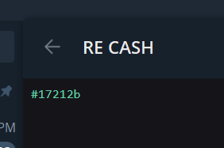
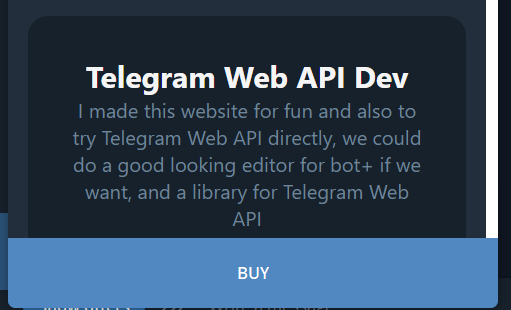
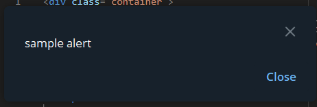

# Telegram Web API Cheatsheet

To start using the API, put this into your HTML:

```html
<script src="https://telegram.org/js/telegram-web-app.js"></script>
```

When you add it to your HTML, you get the `window.Telegram` object and also some CSS style variables.

Most of your work with the Telegram API will be with [`window.Telegram.WebApp`](https://core.telegram.org/bots/webapps#initializing-web-apps), which contains a lot of useful methods and properties.

## CSS

You can use the API's CSS variables so your web app will match the user's Telegram theme that they chose; you don't need to do anything, the CSS variables are ready to use!


```css
var(--tg-theme-bg-color)
var(--tg-theme-text-color)
var(--tg-theme-hint-color)
var(--tg-theme-link-color)
var(--tg-theme-button-color)
var(--tg-theme-button-text-color)
var(--tg-theme-secondary-bg-color)
```

You can also access them using JavaScript:

```javascript
const {
  bg_color,
  text_color,
  hint_color,
  button_color,
  button_text_color,
  secondary_bg_color,
} = Telegram.WebApp.themeParams;
```

## User Authentication

To make sure that the users who are using your app are the real ones and also to make sure they are using your app from the Telegram app, you need to authenticate your users; this is an important step, so don't skip it!

First, you need to get the user's `Telegram.WebApp.initData`, which is a string that contains a query with these params:

- `auth_date`: Unix time when the form was opened.
- `hash`: A hash of all passed parameters, which the bot server can use to check their validity.
- `query_id`: Optional. A unique identifier for the Web App session, required for sending messages via the [`answerWebAppQuery`](https://core.telegram.org/bots/api#answerwebappquery) method.
- `user`:
  - `id`
  - `first_name`
  - `last_name`
  - `username`
  - `language_code`, for example `en`

Example:

```javascript
query_id=<query_id>&user=%7B%22id%22%3A<user_id>%2C%22first_name%22%3A%22<first_name>%22%2C%22last_name%22%3A%22<last_name>%22%2C%22username%22%3A%22<username>%22%2C%22language_code%22%3A%22<language_code>%22%7D&auth_date=<auth_date>&hash=<hash>
```

Secondly, you need to pass that query to the backend to validate the data.

This is how you do it:

```javascript
data_check_string = ...
secret_key = HMAC_SHA256(<bot_token>, "WebAppData")
if (hex(HMAC_SHA256(data_check_string, secret_key)) == hash) {
  // Data is from Telegram
}
```

Using JavaScript, you can validate the data like that:

```javascript
const verifyTelegramWebAppData = (telegramInitData: string) => {
  // The data is a query string, which is composed of a series of field-value pairs.
  const encoded = decodeURIComponent(telegramInitData);

  // HMAC-SHA-256 signature of the bot's token with the constant string WebAppData used as a key.
  const secret = crypto.createHmac("sha256", "WebAppData").update(botToken);

  // Data-check-string is a chain of all received fields'.
  const arr = encoded.split("&");
  const hashIndex = arr.findIndex((str) => str.startsWith("hash="));
  const hash = arr.splice(hashIndex)[0].split("=")[1];
  // Sorted alphabetically
  arr.sort((a, b) => a.localeCompare(b));
  // In the format key=<value> with a line feed character ('\n', 0x0A) used as separator
  // e.g., 'auth_date=<auth_date>\nquery_id=<query_id>\nuser=<user>
  const dataCheckString = arr.join("\n");

  // The hexadecimal representation of the HMAC-SHA-256 signature of the data-check-string with the secret key
  const _hash = crypto
    .createHmac("sha256", secret.digest())
    .update(dataCheckString)
    .digest("hex");

  // If hash is equal, the data may be used on your server.
  // Complex data types are represented as JSON-serialized objects.
  return _hash === hash;
};
```

Now you made sure that the user who uses your app is the real one and also they use the Telegram app; now your app is secure!

## Getting User Data

After authenticating the user from the backend, we can go back to the frontend and get the user's data:

```javascript
const params = new URLSearchParams(Telegram.WebApp.initData);

const userData = Object.fromEntries(params);
userData.user = JSON.parse(userData.user);

// Now userData is ready to use!
```

## Back Button



```javascript
const tg = Telegram.WebApp;

// Show the back button
tg.BackButton.show();

// Check if the button is visible
tg.BackButton.isVisible;

// Click Event
const goBack = () => {
  // Callback code
};

tg.BackButton.onClick(goBack);

// Remove Click Event
tg.BackButton.offClick(goBack);

// Hide the back button
tg.BackButton.hide();
```

## Main Button



```javascript
const tg = Telegram.WebApp.MainButton;

// Properties
tg.text; // You can change the value
tg.color; // You can change the value
tg.textColor; // You can change the value
tg.isVisible;
tg.isActive;
tg.isProgressVisible;

// Events
tg.onClick(callback);
tg.offClick(callback);

// Methods
tg.setText("buy");
tg.show();
tg.hide();
tg.enable(); // Default
tg.disable(); // If the button is disabled, then it will not work when clicked
tg.showProgress(true); // Shows a spinning icon; if you passed into it `false`, then it will disable the button when loading
tg.hideProgress();
```

## Closing Confirmation


When you call this method, it will wait until the user tries to close the app; then it will ask for a confirmation

```javascript
const tg = Telegram.WebApp;
tg.enableClosingConfirmation();
tg.disableClosingConfirmation();
```

## Open a Link

In a browser

```javascript
const tg = window.Telegram.WebApp;
tg.openLink("https://youtube.com");
```

## Show Popup


```javascript
const tg = Telegram.WebApp;
tg.showPopup(
  {
    title: "Sample Title", // Optional
    message: "Sample message",
    buttons: [{ type: "destructive", text: "oh hell nah" }], // Optional
  },
  callback
);
```

More on button types [here](https://core.telegram.org/bots/webapps#popupbutton)

### Show Alert



If an optional callback parameter was passed, the callback function will be called, and the field id of the pressed button will be passed as the first argument.

```javascript
const tg = window.Telegram.WebApp;
tg.showAlert("sample alert", callback);
```

### Show Confirm


If an optional callback parameter was passed, the callback function will be called when the popup is closed, and the first argument will be a boolean indicating whether the user pressed the 'OK' button.

## Scanning QR Code

If an optional callback parameter was passed, the callback function will be called, and the text from the QR code will be passed as the first argument. Returning true inside this callback function causes the popup to be closed.

```javascript
const tg = window.Telegram.WebApp;

tg.showScanQrPopup({ text: "capture" }, callback);

tg.closeScanQrPopup();
```

## App Ready?

A method that informs the Telegram app that the Web App is ready to be displayed.

```javascript
const tg = window.Telegram.WebApp;
tg.ready();
```

## Expand App (Fullscreen)

```javascript
const tg = window.Telegram.WebApp;
tg.isExpanded;
tg.expand();
```

## Contributing

Feel free to contribute to this cheatsheet!
