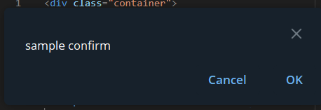

# Telegram Web API

To start using the api put this into your html:

```js
<script src='https://telegram.org/js/telegram-web-app.js'></script>
```

When you add it to your html you get `window.Telegram` object and also some css styles variables.

Most of your work with telegram api will be with [`window.Telegram.WebApp`](https://core.telegram.org/bots/webapps#initializing-web-apps) which contains a lot of useful methods and properties.

## CSS

You can use the api's css variables so your web app will match the user's telegram theme that they chose, you don't need to do anything, the css variables are ready to use!


`var(--tg-theme-bg-color)`

`var(--tg-theme-text-color)`

`var(--tg-theme-hint-color))`

`var(--tg-theme-link-color)`

`var(--tg-theme-button-color)`

`var(--tg-theme-button-text-color)`

`var(--tg-theme-secondary-bg-color)`

You can also access them using javascript:

```js
const {
  bg_color,
  text_color,
  hint_color,
  button_color,
  button_text_color,
  secondary_bg_color,
} = Telegram.WebApp.themeParams
```

## User Authentication

To make sure that the users who are using your app are the real ones and also to make sure they are using your app from the telegram app you need to authenticate your users, this is an important step so don't skip it!

First you need to get the user's `Telegram.WebApp.initData`, this is a string which contains a query with these params:

`auth_date`: Unix time when the form was opened.

`hash`: A hash of all passed parameters, which the bot server can use to check their validity.

`query_id`: Optional. A unique identifier for the Web App session, required for sending messages via the [`answerWebAppQuery`](https://core.telegram.org/bots/api#answerwebappquery) method.

`user`

- `id`
- `first_name`
- `last_name`
- `username`
- `language_code`, for example `en`

Example:

```js
query_id=<query_id>&user=%7B%22id%22%3A<user_id>%2C%22first_name%22%3A%22<first_name>%22%2C%22last_name%22%3A%22<last_name>%22%2C%22username%22%3A%22<username>%22%2C%22language_code%22%3A%22<language_code>%22%7D&auth_date=<auth_date>&hash=<hash>
```

Secondly you need to pass that query to the backend to validate the data.

This is how you do it:

```js
data_check_string = ...
secret_key = HMAC_SHA256(<bot_token>, "WebAppData")
if (hex(HMAC_SHA256(data_check_string, secret_key)) == hash) {
  // data is from Telegram
}
```

Using javascript you can validate the data like that:

```js
const CryptoJS = require('crypto-js')

export const verifyTelegramWebAppData = async (initData: string) => {
  const initData = new URLSearchParams(initData)
  const hash = initData.get('hash')
  let dataToCheck: string[] = []

  initData.sort()
  initData.forEach(
    (val, key) => key !== 'hash' && dataToCheck.push(`${key}=${val}`)
  )

  const secret = CryptoJS.HmacSHA256(TELEGRAM_BOT_TOKEN, 'WebAppData')
  const _hash = CryptoJS.HmacSHA256(dataToCheck.join('\n'), secret).toString(
    CryptoJS.enc.Hex
  )

  return _hash === hash
}
```

Now you made sure that the user who use your app is the real one and also they use the telegram app, now your app is secure!

## Getting user data

After authenticating user from the backend we can go back to the frontend and get the user's data:

```js
const params = new URLSearchParams(Telegram.WebApp.initData)

const userData = Object.fromEntries(params)
userData.user = JSON.parse(userData.user)

// now userData is ready to use!
```

## Back Button


```js
const tg = Telegram.WebApp

// show the back button
tg.BackButton.show()

// check if button is visible
tg.BackButton.isVisible

// Click Event
const goBack = () => {
  // callback code
}

onClick(goBack)

// Remove Click Event
offClick(goBack)

// hide the back button
tg.BackButton.hide()
```

## Main Button


```js
const tg = Telegram.WebApp

// properties
tg.text // you can change the value
tg.color // you can change the value
tg.textColor // you can change the value
tg.isVisible
tg.isActive
tg.isProgressVisible

// events
tg.onClick(callback)
tg.offClick(callback)

// methods
tg.setText('buy')
tg.show()
tg.hide()
tg.enable() // default
tg.disable() // if button is disabled then it will not work when clicked
tg.showProgress(true) // shows a spinning icon, if you passed into it `false` then it will disable the button when loading
tg.hideProgress()
```

## Closing Confermation


When you call this method it will wait until the user try to close the app then it will ask for a confirmation

```js
const tg = Telegram.WebApp
tg.enableClosingConfirmation()
tg.disableClosingConfirmation()
```

## Open a link

In a browser

```js
const tg = window.Telegram.WebApp
tg.openLink('https://youtube.com')
```

## Show Popup


```js
const tg = Telegram.WebApp
tg.showPopup(
  {
    title: 'Sample Title', // optional
    message: 'Sample message',
    buttons: [{ type: 'destructive', text: 'oh hell nah' }], // optional
  },
  callback
)
```

More on button types [here](https://core.telegram.org/bots/webapps#popupbutton)

### Show Alert


If an optional callback parameter was passed, the callback function will be called and the field id of the pressed button will be passed as the first argument.

```js
const tg = window.Telegram.WebApp
tg.showAlert('sample alert', callback)
```

### Show Confirm



If an optional callback parameter was passed, the callback function will be called when the popup is closed and the first argument will be a boolean indicating whether the user pressed the 'OK' button.

## Scanning QR Code

If an optional callback parameter was passed, the callback function will be called and the text from the QR code will be passed as the first argument. Returning true inside this callback function causes the popup to be closed.

```js
const tg = window.Telegram.WebApp

tg.showScanQrPopup(
  { text: 'capture' },
  callback
)

tg.closeScanQrPopup()
```

## App ready?

A method that informs the Telegram app that the Web App is ready to be displayed.

```js
const tg = window.Telegram.WebApp
tg.ready()
```

## Exapnd App (fullscreen)

```js
const tg = window.Telegram.WebApp
tg.isExpanded
tg.expand()
```

